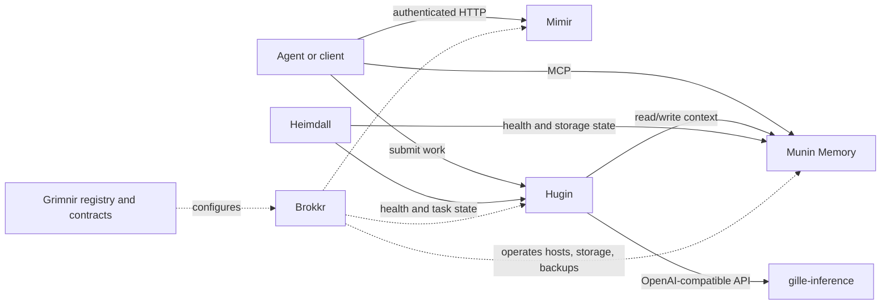

# Grimnir

Grimnir is a modular, self-hosted control plane for personal AI. It connects durable memory,
user-controlled files, asynchronous work, local model inference, monitoring, and host operations
without requiring one application to own the entire system.

This repository is the architecture and operations layer. Service code lives in the component
repositories.

> **Project status:** early-stage reference implementation. It is useful for studying and adapting,
> but it is not a turnkey appliance. Interfaces and deployment conventions may still change.

## The ecosystem

| Layer | Component | Responsibility |
|---|---|---|
| Control plane | **Grimnir** | Architecture, registry, deployment checks, and cross-service contracts |
| Knowledge | **[Munin Memory](https://github.com/Magnus-Gille/munin-memory)** | Durable, searchable memory exposed through MCP |
| Files | **[Mimir](https://github.com/Magnus-Gille/mimir)** | Authenticated access to user-controlled files |
| Execution | **[Hugin](https://github.com/Magnus-Gille/hugin)** | Queues, gates, and dispatches asynchronous agent work |
| Inference | **[gille-inference](https://github.com/Magnus-Gille/gille-inference)** | OpenAI-compatible gateway for locally served models |
| Observability | **[Heimdall](https://github.com/Magnus-Gille/heimdall)** | Health, maintenance, and task visibility |
| Substrate | **[Brokkr](https://github.com/Magnus-Gille/brokkr)** | Host configuration, storage, backups, patching, and recovery |

The seven repositories above are enough to understand the public architecture. Three additional
roles appear in some design documents and in the example registry:

- **Ratatoskr** is an optional chat or notification adapter.
- **Skuld** is an optional scheduled briefing producer.
- **Verdandi** is an optional external audit-event sink.

They are integrations, not hidden dependencies. Hugin can be called directly, notifications are
optional, and the core reversal/audit contract is documented in
[`docs/failure-recovery.md`](docs/failure-recovery.md).

## How the pieces fit



The important boundary is between **agent services** and the **substrate**. Services use explicit
contracts for memory, inference, mutations, and audit events. Brokkr owns the machines and recovery
mechanisms. See [`docs/architecture.md`](docs/architecture.md) for the full model.

## What is public and what stays local

The committed [`services.json`](services.json) is deliberately fictional example data. It documents
the schema and a representative topology, and deployment code refuses to use it.

For a real installation:

```bash
cp services.json services.local.json
# Set public_example to false and replace example hostnames, component choices,
# unit selections, and paths other than Grimnir's fixed control-plane path.
make test
DEPLOY_USER=operator make deploy ARGS="munin-memory"
```

`services.local.json`, `.env` files, operational status, generated deployment snapshots, and logs are
ignored. Do not publish them. The local registry is selected automatically when present; automation
can instead set `REGISTRY_PATH` explicitly. Deployment fails closed unless the selected registry
contains the exact JSON boolean `"public_example": false`.

The Grimnir control plane has one explicit fixed deployment contract: its system units run as the
non-login `grimnir` system account from `/srv/grimnir/control-plane`. The registry validator rejects
another deploy path for the `grimnir` component because these committed units are installed without
rendering. `DEPLOY_USER` is required and names a separate SSH operator with only the sudo rights
needed to install and control the declared units. The deployer rejects `DEPLOY_USER=grimnir`; a
runtime-service compromise must not inherit SSH or host-management authority.

The committed Grimnir scan and validation units also require two explicit local prerequisites:

- root-owned, read-only source checkouts under `/srv/grimnir/source/<repo>` for the security scanner;
  these are separate from rsync deployment targets, which intentionally contain no `.git` metadata;
- a one-line Munin API key at `/etc/grimnir/credentials/munin-api-key`, owned by root and mode `0600`.

The units deliver that key with systemd `LoadCredential=` and put only the ephemeral credential path
in `ExecStart=`. They do not put the secret in `Environment=` or the unit command line. Change the
unit and its regression test together if a deployment uses another protected source root or
credential provider.

## Repository map

- [`docs/architecture.md`](docs/architecture.md) — layers, trust boundaries, and data flows
- [`docs/authority.md`](docs/authority.md) — which artifact owns each kind of configuration
- [`docs/tenant-contract.md`](docs/tenant-contract.md) — minimum contract for an agent or harness
- [`docs/learning-task-contract.md`](docs/learning-task-contract.md) — versioned Hugin↔inference learning-evidence seam
- [`docs/learning-task-contract-v1.schema.json`](docs/learning-task-contract-v1.schema.json) — canonical schema for the seven v1 evidence/accounting record kinds
- [`docs/observability-and-improvement.md`](docs/observability-and-improvement.md) — three-plane improvement architecture and roadmap
- [`docs/adr-006-learning-improvement-scope.md`](docs/adr-006-learning-improvement-scope.md) — reviewed boundary between configuration learning and model training
- [`docs/threat-model.md`](docs/threat-model.md) — assets, threats, and required controls
- [`docs/data-lifecycle.md`](docs/data-lifecycle.md) — retention, correction, deletion, and backup expiry
- [`docs/failure-recovery.md`](docs/failure-recovery.md) — reversible autonomous mutation convention
- [`services.json`](services.json) — safe, non-deployable example registry
- [`scripts/`](scripts/) — validation, deployment, documentation, and security checks

## Development

The system-level repository has no runtime dependencies. Run its regression suite with:

```bash
make test
shellcheck scripts/*.sh scripts/lib/*.sh scripts/tests/*.sh
```

Run a dry security sweep across locally checked-out components with:

```bash
make security-dry
```

Read [`CONTRIBUTING.md`](CONTRIBUTING.md) before proposing changes and [`SECURITY.md`](SECURITY.md)
before reporting a vulnerability. Maintainers should complete
[`PUBLICATION_CHECKLIST.md`](PUBLICATION_CHECKLIST.md) before changing visibility or announcing a
release.

## Related projects

Grimnir overlaps with several excellent open-source projects, but its center of gravity is different:

| Project family | Primary focus | Grimnir's emphasis |
|---|---|---|
| [OpenClaw](https://github.com/openclaw/openclaw) | Integrated personal assistant and channels | Loosely coupled services with explicit ownership boundaries |
| [Letta](https://github.com/letta-ai/letta) | Stateful agents and memory | A whole self-hosted fleet: files, jobs, inference, monitoring, and recovery |
| [Open WebUI](https://github.com/open-webui/open-webui) / [LibreChat](https://github.com/danny-avila/LibreChat) | User-facing model chat | Headless infrastructure that multiple clients and harnesses can use |
| [OpenHands](https://github.com/All-Hands-AI/OpenHands) / [OpenCode](https://github.com/anomalyco/opencode) | Coding-agent execution | General task dispatch and durable cross-session context |
| [LiteLLM](https://github.com/BerriAI/litellm) | Model-provider routing | Local model serving as one subsystem inside a broader control plane |

Grimnir is intentionally small-service and operator-controlled: SQLite, systemd, JSON registries,
and replaceable interfaces rather than a required cluster orchestrator.

## Security and privacy

Self-hosted does not mean isolated. Authoritative data can remain on hardware you control, but prompts
or files leave that boundary whenever you configure a remote model, tunnel, backup provider, or
notification service. Each deployment must choose and document its own trust boundaries.

The example configuration is not production-ready. Use per-service authentication, least-privilege
network exposure, encrypted backups, secret scanning, and tested recovery before storing sensitive
data.

## License

[MIT](LICENSE)
