# ADR-007: Node/Substrate authority and reconciliation

- **Status:** accepted
- **Date:** 2026-07-23
- **Decision owner:** Grimnir system architecture
- **Component reviewers required:** Brokkr and the first workload owners that consume the schema
- **Tracking issue:** [#101](https://github.com/Magnus-Gille/grimnir/issues/101)

## Context

The NAS relocation preflight showed that one physical move can affect network reachability,
storage, backups, monitoring and several service-specific dependencies. Today those facts must be
assembled manually from the registry, repository state and host inspection. That is neither a
safe reconciliation interface nor a reliable basis for moving a workload such as Hugin to M5.

This ADR defines the boundary before the contracts in the Node/Substrate program become executable.
It deliberately does not choose a fleet manager or move application behaviour into Brokkr.

## Decision

### Authority model

| Fact or decision | Authority | May report/consume it | Must not do |
|---|---|---|---|
| Desired topology, node identity, intended workload placement, cross-component policy and shared registry | Grimnir | Brokkr, component repos, Heimdall | Claim a host is currently capable or healthy without evidence |
| Observed node capabilities, network/storage/location realization, preflight, relocation steps, evidence and substrate rollback | Brokkr | Grimnir, component repos, Heimdall | Rewrite desired placement or decide product behaviour |
| Runtime requirements, artifacts, service health, drain/verify hooks, data migration semantics and workload rollback | Owning component repo | Brokkr and Heimdall through versioned contracts/evidence | Delegate application semantics to Brokkr |
| Monitoring transport and presentation | Heimdall | All owners | Become topology authority or infer desired state from a green probe |

`services.json` remains the canonical registry for **desired** public-safe topology. Brokkr owns
the **observed** host facts and realization evidence. A workload contract states what a component
**requires**; a lifecycle result records what one reconciliation attempt **did**. These are four
separate fact classes and must not overwrite one another.

Private topology, Wi-Fi identities, credentials and live locators stay in owner-only overlays.
The shared schemas and fixtures use synthetic, non-routable examples only.

### Reconciliation state machine

```mermaid
stateDiagram-v2
    [*] --> desired_changed: desired placement/version changes
    desired_changed --> observe: Brokkr collects fresh observed facts
    observe --> blocked: unknown, stale, unavailable, or incompatible evidence
    observe --> preflight: read-only requirements and hook declarations are satisfiable
    preflight --> blocked: network/storage/rollback or required-hook declaration fails
    preflight --> operator_gate: physical move or protected action needs operator
    operator_gate --> drain: fresh preflight confirms completed prerequisite
    preflight --> drain: no operator action required
    drain --> compensate: mutating workload hook fails, times out, or completes partially
    drain --> realize: workload drain completes
    realize --> substrate_rollback: substrate action fails, times out, or completes partially
    realize --> verify: substrate action completes
    substrate_rollback --> blocked: substrate pre-state verification fails
    substrate_rollback --> compensate: substrate pre-state restored; restore workload baseline
    compensate --> blocked: compensation or baseline verification fails
    compensate --> observe: compensation restores the verified baseline
    verify --> promoted: all fresh evidence and hooks pass
    verify --> rollback: verification fails after mutation
    rollback --> blocked: rollback incomplete or verification remains failed
    rollback --> observe: rollback verified
    blocked --> observe: corrected desired state or fresh evidence
    promoted --> [*]
```

The state machine is a contract for later implementations, not proof that an implementation or
automation exists today. No transition changes the desired registry except an explicit Grimnir
change; no transition fabricates observed capabilities.

### Physical versus workload relocation

A **physical node relocation** changes where a machine is connected or housed. Brokkr owns the
network/storage preflight, realization evidence and substrate rollback. It can require an operator
to unplug, move, power or reconnect hardware; automation must stop at that gate and record the
unmet prerequisite.

A **workload relocation** changes a component's desired placement. It begins with a Grimnir
registry change. Brokkr may determine whether a target meets the workload contract and may realize
the substrate steps, but the component owner retains drain, data-transfer, start, health and
semantic verification. Moving a workload never authorizes a physical move, and moving a node
never silently changes workload intent.

### Workload hooks

Each workload can publish a small versioned contract naming its requirements and hooks. Hooks are
declarations at the boundary, not code imported into Brokkr:

- read-only `preflight` checks whether declared prerequisites are currently satisfiable;
- mutating `drain` prepares the workload for a move;
- `verify` attests service-specific health after a substrate step;
- mutating `rollback` or `compensate` restores the workload's own data, availability or runtime
  state when needed.

Brokkr invokes only an agreed hook interface, captures the result as evidence and fails closed on
a missing, incompatible, timed-out or unsuccessful hook. It does not interpret business data,
rewrite service configuration, or substitute its own health check for the component's verification.
The component owner defines hook side effects, time bounds, data migration semantics and rollback
recipe.

Read-only hooks may participate in preflight. A mutating hook may run only after preflight, inside
an accepted lifecycle attempt with a declared reversal or compensation recipe. If `drain` or any
other mutating hook times out, fails, or reports partial completion, the lifecycle enters
`compensate`; it must run the component-owned recipe and verify the pre-attempt workload baseline
before becoming eligible for another plan. Missing compensation blocks mutation up front.
Compensation failure is a terminal blocked result requiring the declared disaster-recovery path;
it is never silently retried as a fresh drain.

Every hook invocation and result is bound to one lifecycle attempt. The invocation envelope carries
an attempt ID, plan ID and digest, desired revision, observation/evidence IDs, action and hook
digest, deadline, and idempotency key. The result echoes those bindings plus its result ID,
timestamps and outcome. Brokkr rejects an expired result, a binding mismatch, or a result replayed
from another attempt. Retrying the same idempotency key returns the recorded result rather than
repeating side effects; a new attempt and key are allowed only after the prior attempt is promoted
or its compensation/rollback baseline is verified.

### Conflict, unknown and stale semantics

Desired state and observed state are not voted together. A conflict is represented explicitly:

- if desired placement differs from a fresh observation, the system is **drifted**, not converged.
  That expected difference is the input to a reconciliation plan, not by itself a reason the plan
  can never execute. The plan binds the exact desired revision, observation and scoped changes;
- if the desired revision changes after planning, or fresh observation finds drift outside the
  plan's bound baseline, the plan is stale and must be rebuilt before mutation;
- if observation is absent, too old for the declared freshness bound, malformed, or from an
  incompatible contract version, it is **unknown**;
- an unavailable Brokkr observer, Heimdall transport, or required workload hook makes the relevant
  lifecycle result **blocked** rather than healthy;
- only the authority for a fact may correct that fact. Grimnir changes intent; Brokkr refreshes
  observations; the workload owner corrects its requirements/hooks; Heimdall corrects presentation.

Preflight and mutation fail closed for **unplanned or baseline-changing drift**, unknown, stale or
blocked decision-driving inputs. Planned drift may proceed only through the exact bound plan after
all gates pass; promotion requires that its scoped drift is gone. Heimdall may display these states
and transport evidence, but its availability is never proof of topology or workload health. If
Heimdall is unavailable, reconciliation evidence is retained by the producing owner and promotion
still requires the declared evidence; presentation is recorded as degraded rather than inferred
green.

### Availability failure behavior

If **Brokkr is unavailable**, no fresh observation or substrate preflight can be produced. A plan
that depends on either remains blocked; neither Grimnir nor Heimdall may substitute a cached green
status for it. If **Heimdall is unavailable**, monitoring transport/presentation is degraded but it
does not change the authority of producer evidence; the lifecycle attempt is still blocked unless
the declared promotion policy explicitly permits retained, independently readable evidence. If a
required **workload hook is unavailable**, returns an incompatible result, or times out, the
workload verification is blocked and Brokkr must not promote the move. After a mutation has begun,
the applicable substrate and workload rollback recipes are invoked before any later retry.

An operator gate is explicit whenever a prerequisite cannot safely be automated, including a
physical move, cabling, power, a protected credential step, or a data-transfer decision outside
the declared workload contract. The lifecycle record names the required operator action and stays
blocked until the next fresh preflight; an operator acknowledgement alone is not verification.

### Rollback and promotion

Brokkr owns rollback of substrate steps it performed: location/network/storage realization and
its recorded pre-state. The workload owner owns rollback of service data, deployment and semantic
state. A mixed move has both recipes; neither owner may claim the other recipe succeeded.

A failed, timed-out or partially applied substrate action enters `substrate_rollback`; Brokkr must
restore and verify its recorded substrate pre-state before any retry. If the workload was already
drained, successful substrate rollback then proceeds through the component-owned compensation path
to restore and verify workload availability. Incomplete substrate rollback is terminally blocked
under the declared disaster-recovery path and cannot be retried as a fresh realization.

Promotion requires a fresh observation, successful Brokkr preflight/reconciliation evidence and
every required component-owned verification hook, all bound to the exact lifecycle attempt and
plan. A failure after mutation triggers the relevant compensation or rollback recipes and leaves
the lifecycle result blocked until the pre-attempt baseline or declared recovery state is verified.
The general audit and reversal-recipe convention in
[failure-recovery.md](failure-recovery.md) still applies to autonomous mutations; this ADR assigns
operational ownership, not an exemption from audit.

## Consequences

- Schema work can distinguish `desired`, `observed`, `requirements` and `lifecycle_result` records
  without creating a god repository.
- A Hugin-to-M5 plan can be evaluated against declared requirements before changing Hugin.
- A NAS move can be planned as a Brokkr operation while exposing any operator-only physical step.
- Existing operational facts remain observed or manual until a producer emits versioned evidence;
  documentation is not a live inventory.

## Review record and schema gate

The boundary was accepted on 2026-07-23 after independent Brokkr-owner and first workload-owner
(Mimir) reviews. The Brokkr review found and required three corrections before passing: planned
versus unexpected drift, attempt-bound/idempotent hook results with compensation, and an explicit
partial-substrate rollback path. The Mimir review passed the component-ownership, persistent-data,
hook, private-overlay and workload-rollback boundary. Root review and bounded M5 classifications
were additional evidence, not substitutes for those owner reviews.

Implementation tickets must cite this ADR and carry positive, mixed-version and adversarial
fixtures before enabling live mutation. Acceptance of this authority model does not itself freeze
a schema version or authorize a production relocation.

## Non-goals

- Selecting Kubernetes, NixOS, or a generic fleet manager.
- Moving component business logic, data migration semantics or health definitions into Brokkr.
- Revealing private network identity, credentials or live locators in shared contracts.
- Authorizing a production Hugin relocation.
