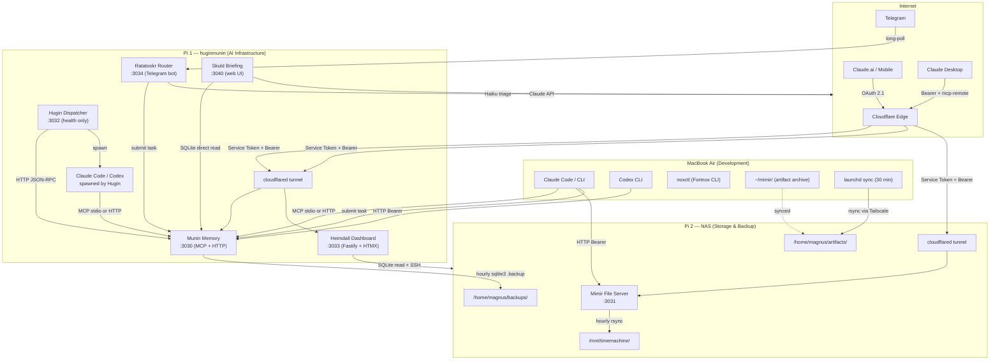
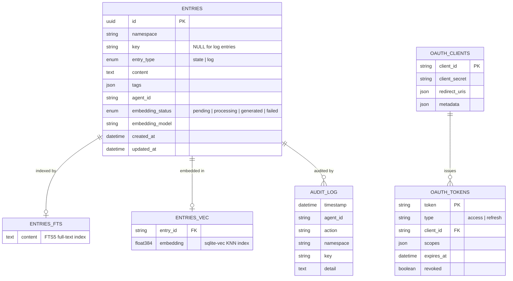
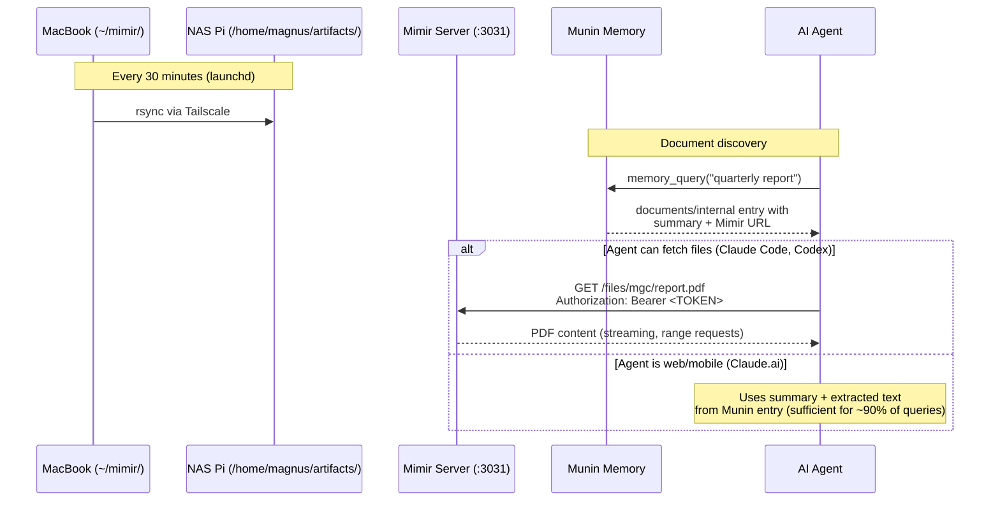
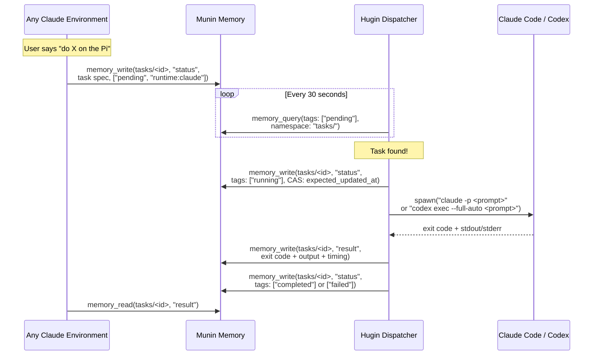

# The Grimnir System — Architecture Guide

> Internal reference document for the Grimnir personal AI infrastructure.
> Last updated: 2026-03-21.

---

## The Grimnir System

Grimnir is a personal AI infrastructure that gives Claude persistent memory, file access, and autonomous task execution across every environment — from a phone on the bus to a terminal at the desk. It runs on two Raspberry Pis and a MacBook, under the principle that **data sovereignty and simplicity beat sophistication**.

### Why it exists

Every conversation with Claude starts from zero. There is no memory between sessions, no access to personal files, and no way to say "do this while I sleep." Grimnir solves these three problems:

1. **Memory** — Munin gives Claude persistent, searchable memory across every environment (desktop, mobile, web, CLI).
2. **Files** — Mimir makes personal documents available to agents over HTTPS, with summaries cached in Munin for environments that can't fetch files directly.
3. **Autonomy** — Hugin lets any Claude session submit a task that gets executed on the Pi, with results written back to memory. Skuld synthesizes overnight signals into a morning briefing.

### Design philosophy

Three principles guide every decision:

- **Sovereignty** — All data lives on Magnus's hardware. The Pis hold the database, the files, and the backups. Cloud AI services are stateless tools; they process but don't store.
- **Privacy** — Writes to memory are scanned for secrets before storage. Auth is required at every layer. Sensitive documents get summaries in Munin but full text stays on the Pi.
- **Simplicity** — Each service is a single-purpose Node.js/TypeScript application. No frameworks beyond Express/Fastify for HTTP. No ORMs. No Kubernetes. SQLite for storage. systemd for process management.

---

## Components at a Glance

| Component | Role | Port | Host | Repo |
|-----------|------|------|------|------|
| **Munin Memory** | Persistent memory MCP server | 3030 | Pi 1 | `munin-memory` |
| **Hugin** | Task dispatcher | 3032 | Pi 1 | `hugin` |
| **Heimdall** | Monitoring dashboard | 3033 | Pi 1 | `heimdall` |
| **Ratatoskr** | Telegram router + concierge | 3034 | Pi 1 | `ratatoskr` |
| **Skuld** | Daily intelligence briefing | 3040 | Pi 1 | `skuld` (grimnir-bot) |
| **Mimir** | Authenticated file server | 3031 | Pi 2 (NAS) | `mimir` |
| **noxctl** | Accounting CLI + MCP | — | Laptop (global) | `fortnox-mcp` |

---

## System Topology

The system spans two Raspberry Pis and a MacBook Air, connected via Tailscale (private mesh VPN) and exposed to cloud services through Cloudflare Tunnels.



### Hardware

| Unit | Hostname | Role | Key Services |
|------|----------|------|-------------|
| Pi 1 | `huginmunin.local` | AI infrastructure (compute) | Munin, Hugin, Heimdall, Skuld |
| Pi 2 | NAS | Storage & backup | Mimir, Samba, Time Machine |

Both Pis are Raspberry Pi 5 units (8 GB RAM) in Flirc passive-cooling aluminum cases. They run on the same local network and are also connected via Tailscale for reliable cross-Pi communication.

### Network model

- **Local services** bind to `127.0.0.1` — never exposed on the LAN directly.
- **Cloudflare Tunnels** provide HTTPS ingress from the internet, with edge-layer authentication (CF Access).
- **Tailscale** provides encrypted Pi-to-Pi and laptop-to-Pi communication for rsync, SSH, and backups.
- **Public endpoints:** `munin-memory.gille.ai`, `heimdall.gille.ai`, `mimir.gille.ai`

---

## Munin — Memory

Munin is the brain of the system. It is an MCP (Model Context Protocol) server that gives Claude persistent, searchable memory across every environment — desktop app, mobile, web, and CLI.

### Architecture

- **Runtime:** Node.js 20+, TypeScript (strict mode)
- **Database:** SQLite via `better-sqlite3`, with FTS5 full-text search and `sqlite-vec` for vector search
- **Protocol:** MCP over stdio (local) or stateless Streamable HTTP (network)
- **Auth:** Dual — legacy Bearer token for CLI/Desktop + OAuth 2.1 for web/mobile
- **Deployment:** systemd on Pi 1, exposed via Cloudflare Tunnel

### Data model

Munin stores two fundamental types of entry in a single `entries` table:



**State entries** are mutable key-value pairs, identified by `namespace + key`. They represent current truth — a project's status, a person's contact info, a decision record. Writing to the same namespace+key overwrites the previous value.

**Log entries** are append-only, timestamped, and have no key. They represent chronological history — decisions made, milestones reached, events recorded. Log entries are never modified after creation.

**Namespaces** are hierarchical strings separated by `/` (e.g., `projects/munin-memory`, `people/magnus`, `documents/internal`). They are created implicitly on first write.

### Search

Munin supports three search modes through `memory_query`:

| Mode | Mechanism | Best for |
|------|-----------|----------|
| **Lexical** | FTS5 keyword search | Exact terms, known identifiers |
| **Semantic** | sqlite-vec KNN over 384-dim embeddings | Conceptual similarity, natural language |
| **Hybrid** | Reciprocal Rank Fusion (RRF) of both | General queries (default) |

Embeddings are generated asynchronously by a background worker using Transformers.js with the `all-MiniLM-L6-v2` model. Writes are never blocked by embedding generation. A circuit breaker trips after repeated failures, gracefully degrading all search to lexical mode.

### MCP tools

| Tool | Purpose |
|------|---------|
| `memory_orient` | Start-of-conversation orientation: conventions, computed project dashboard, namespace overview, maintenance suggestions |
| `memory_write` | Store or update a state entry. Supports compare-and-swap for concurrent safety |
| `memory_read` | Retrieve a specific state entry by namespace + key |
| `memory_read_batch` | Retrieve multiple entries in one call |
| `memory_get` | Retrieve any entry (state or log) by UUID |
| `memory_query` | Search memories with lexical, semantic, or hybrid modes |
| `memory_log` | Append an immutable log entry |
| `memory_delete` | Delete with token-based two-step confirmation |

### Computed dashboard

`memory_orient` dynamically computes a project dashboard from status entries in `projects/*` and `clients/*` namespaces. Entries are grouped by lifecycle tag (`active`, `blocked`, `completed`, `stopped`, `maintenance`, `archived`), with maintenance suggestions surfaced for stale or misconfigured entries.

### How agents connect

| Environment | Transport | Auth |
|-------------|-----------|------|
| Claude Code (local) | MCP stdio | None (process-level) |
| Claude Code (remote) | MCP HTTP | Bearer token + edge service token |
| Claude Desktop | MCP HTTP via `mcp-remote` bridge | Bearer token + edge service token |
| Claude.ai / Claude Mobile | MCP HTTP with OAuth 2.1 | Dynamic client registration, PKCE |

The HTTP transport runs in **stateless mode**: each POST to `/mcp` creates a fresh MCP server and transport, processes the request, and tears down. This eliminates session management complexity.

---

## Mimir — File Archive

Mimir is a self-hosted authenticated file server. It makes personal documents — PDFs, presentations, images, markdown files — available to AI agents over HTTPS.

### Architecture

- **Runtime:** Node.js 20+, TypeScript (strict mode)
- **Framework:** Express (single ~250-line file)
- **Auth:** Bearer token with timing-safe comparison
- **Deployment:** systemd on Pi 2 (NAS), exposed via Cloudflare Tunnel
- **Storage:** SD card on NAS Pi, backed up hourly to external disk

### Endpoints

| Endpoint | Auth | Purpose |
|----------|------|---------|
| `GET /health` | None | Health check |
| `GET /files/{path}` | Bearer | Serve file from archive, with range request support |
| `GET /list/{path}` | Bearer | JSON directory listing (dotfiles hidden) |

### File flow

Files originate on the MacBook, sync to the NAS Pi, and are discovered by agents through Munin:



### Indexing pipeline

Documents are indexed into Munin under `documents/*` namespaces using a `/index-artifacts` skill. Each indexed entry contains source URL, local path, metadata, summary, key points, and extracted text. Munin serves as the **discovery layer** while Mimir serves as the **content layer**.

---

## Hugin — Task Dispatch

Hugin is the system's hands. It polls Munin for pending tasks, spawns AI runtimes to execute them, and writes results back. Named after Odin's raven of thought.

### Architecture

- **Runtime:** Node.js 20+, TypeScript (strict mode)
- **Framework:** Express (health endpoint only)
- **Deployment:** systemd on Pi 1, co-located with Munin
- **Integration:** Munin HTTP API via JSON-RPC 2.0

### The poll-claim-execute-report lifecycle



### Execution model

- **One task at a time** — no parallelism. Simplicity over throughput.
- **Compare-and-swap claiming** — uses Munin's `expected_updated_at` to prevent double-claiming.
- **Output capture** — ring buffer keeps the last 50,000 characters of combined stdout/stderr. Full output also streamed to per-task log files in `~/.hugin/logs/`.
- **Timeout handling** — SIGTERM after configured timeout, SIGKILL after an additional 10 seconds.
- **Stale task recovery** — on startup, scans for `running` tasks; marks as `failed` if elapsed time exceeds 2x timeout.
- **Graceful shutdown** — SIGTERM forwarded to child process with 30-second grace period.

### Task schema

Any Claude environment (or Ratatoskr) can submit a task by writing to Munin:

```markdown
Namespace: tasks/<task-id>
Key: status
Tags: ["pending", "runtime:claude", "type:code"]

## Task: <title>

- **Runtime:** claude | codex
- **Context:** repo:heimdall | scratch | files | /absolute/path
- **Timeout:** 300000
- **Submitted by:** claude-desktop | ratatoskr
- **Submitted at:** 2026-03-14T10:00:00Z
- **Reply-to:** telegram:12345678 | none
- **Reply-format:** summary | full
- **Group:** 20260323-140000-deploy-cycle
- **Sequence:** 1

### Prompt
<the actual prompt for the AI runtime>
```

**Context resolution:** Hugin resolves the `Context` field to an absolute working directory:

| Context value | Resolved path | Use case |
|---------------|---------------|----------|
| `repo:<name>` | `/home/magnus/repos/<name>` | Code tasks in a specific repo |
| `scratch` | `/home/magnus/scratch` | Research, email, admin, non-code work |
| `files` | `/home/magnus/mimir` | File organization, document work |
| `/absolute/path` | Used as-is | Backward compat, custom paths |
| *(omitted)* | `/home/magnus/workspace` | Legacy default |

`Working dir:` is still accepted for backward compatibility but `Context:` takes priority.

**Reply routing:** When `Reply-to` is set (e.g., `telegram:12345678`), Ratatoskr polls the task result and delivers it back to the specified channel. Without `Reply-to`, results are only available via Munin.

**Task groups:** `Group` and `Sequence` fields link related sub-tasks. Hugin processes them in FIFO order (submission order). Each sub-task's prompt includes a check for the previous step's success.

---

## Ratatoskr — Telegram Router

Ratatoskr is the messenger. Named after the squirrel that carries messages between the eagle and serpent on Yggdrasil, it lets Magnus interact with Grimnir from Telegram — sending tasks from a phone and receiving results back.

### Architecture

- **Runtime:** Node.js 20+, TypeScript (strict mode)
- **Framework:** Express (health endpoint only) + grammy (Telegram bot)
- **AI:** @anthropic-ai/sdk (Haiku for intent triage)
- **Deployment:** systemd on Pi 1, long-polling mode (no inbound HTTP from internet)

### How it works

Ratatoskr is NOT an AI agent. It's plumbing with a thin intelligence layer:

1. **Receive** — Telegram message arrives from an allowlisted user
2. **Triage** — Concierge layer calls Claude Haiku with the message + recent Munin context. Haiku decides: ready to submit, needs clarification, or can answer directly
3. **Clarify** — If ambiguous, replies on Telegram asking for more detail. Conversational loop until intent is clear
4. **Submit** — Writes a well-formed Hugin task to Munin with context, reply routing, and timeout
5. **Monitor** — Polls Munin for task completion every 30 seconds
6. **Deliver** — Sends result summary back on Telegram

The concierge uses Haiku (~$0.001/call) for triage, not the Max plan. The actual task execution runs through Hugin → Claude Code (Max plan).

### Task schema fields set by Ratatoskr

| Field | Value |
|-------|-------|
| `Context` | Inferred by concierge (default: `scratch`) |
| `Runtime` | Always `claude` |
| `Reply-to` | `telegram:<chat_id>` |
| `Submitted by` | `ratatoskr` |

### Telegram commands

| Command | Action |
|---------|--------|
| `/status` | Show active/recent tasks |
| `/cancel <id>` | Cancel a pending task |
| `/raw <prompt>` | Skip concierge, submit verbatim |
| `/repo <name> <prompt>` | Submit to a specific repo context |
| Any other text | Triaged by concierge, then submitted |

---

## Heimdall — Monitoring

Heimdall is the watchman. It provides at-a-glance health visibility for the entire Grimnir infrastructure — both Pis, all services, backups, and autonomous task execution.

### Architecture

- **Runtime:** Node.js, CommonJS
- **Framework:** Fastify + HTMX + Chart.js
- **Database:** SQLite (collected metrics, forensic logs)
- **Deployment:** systemd on Pi 1 (:3033), exposed via Cloudflare Tunnel (heimdall.gille.ai)

### What it monitors

| Category | Metrics | Source |
|----------|---------|--------|
| System Health | CPU temp, memory usage, load average | Both Pis (local + SSH) |
| Temperature History | Temp trend, alert thresholds | Collected samples |
| Disk Usage | SD card + NAS drive capacity/used/trend | `df` on both Pis |
| Backup Freshness | TM last backup, Munin backup age | NAS filesystem |
| Service Health | HTTP health endpoints | munin-memory, mimir, heimdall, hugin |
| MCP Health | Munin MCP transport probe | MCP endpoint |
| Hugin Dispatcher | Heartbeat, uptime, active task | Munin heartbeat entry |
| Hugin Task History | Completed/failed tasks, timing | Munin SQLite (direct read) |
| Deploy Drift | Service version vs git remote | `/health` + `git ls-remote` |

### Design principle

**Heimdall answers one question: "Is the system healthy?"** Green/yellow/red for every service, backup, and resource. It does not try to be the UI for any service — no Munin browser, no task submission, no briefing rendering. For service-specific UIs, use the service directly (e.g., Skuld's web UI at :3040).

### Data collection

Pull model with systemd timers:
- `heimdall-collect.timer` — periodic collection of metrics from both Pis
- `heimdall-maintain.timer` — database maintenance and retention cleanup

### Planned additions

- Skuld briefing status (last run, success/failure) — pending Skuld systemd timer
- Deploy drift UI — collector exists, needs dashboard wiring
- Link to Skuld web UI

---

## Skuld — Daily Intelligence Briefing

Skuld is the oracle. Named after the Norn of the future, it generates a daily intelligence briefing by synthesizing calendar events, project state, and (future) financial data through Claude's API.

### Architecture

- **Runtime:** Node.js 22+, TypeScript (strict mode)
- **Framework:** Express (web UI + API)
- **AI:** @anthropic-ai/sdk (Claude API direct)
- **Data sources:** Google Calendar (ICS), Munin (SQLite direct read), Fortnox (future via noxctl)
- **Deployment:** Pi 1, co-located with Munin for low-latency SQLite reads
- **Repo:** `grimnir-bot/skuld` (private, Magnus-Gille as admin collaborator)

### How it works

1. **Collect** — Fetches calendar events (ICS feed), queries Munin for active projects/client statuses/weekly plan/recent logs
2. **Assemble** — Builds a `BriefingContext` with structured data from all sources
3. **Synthesize** — Sends context to Claude API with a narrative system prompt ("trusted chief of staff" persona)
4. **Deliver** — Outputs briefing to stdout (formatted), Munin (`briefings/daily/{date}`), and web UI

### Briefing sections

- **Day Overview** — what's scheduled, what phase projects are in
- **Attention Needed** — blockers, stale projects, overdue items
- **Preparation** — what to prepare for upcoming meetings/deadlines
- **Looking Ahead** — week/month view

### Output channels

| Channel | Access |
|---------|--------|
| CLI (`skuld briefing`) | Direct on Pi |
| Web UI (`GET /`) | Browser at :3040 |
| JSON API (`GET /api/briefing`) | Programmatic |
| Munin (`briefings/daily/{date}`) | Any Claude environment |

### Roadmap

Phase 1 (MVP) is complete. Phases 2-8 extend from Fortnox financial awareness through commitment tracking, meeting prep cards, relationship heat maps, weekly ritual automation, and Hugin scheduled runs.

---

## Fortnox MCP / noxctl — Accounting

noxctl is a CLI and MCP server for Fortnox, the Swedish accounting platform. It handles invoices, customers, bookkeeping, and VAT.

### Architecture

- **Runtime:** Node.js 20+, TypeScript (strict mode)
- **Interfaces:** CLI (`commander`) + MCP server (`@modelcontextprotocol/sdk`)
- **Auth:** OAuth2 with secure credential storage (OS keychain)
- **Deployment:** Installed globally via npm on laptop. CLI preferred in Claude Code, MCP server for Desktop/Web/Mobile.

### Capabilities

- Customers: list, get, create, update
- Invoices: list, get, create, update, send, bookkeep, credit
- Bookkeeping: vouchers, accounts (chart of accounts)
- Tax: VAT report (informational)
- Company: info
- Utility: init (setup wizard), doctor (validate), logout

### Output

Table on TTY, JSON when piped. Mutation operations prompt for confirmation on interactive terminals; non-interactive requires `--yes` or `--dry-run`.

---

## Security Model

Every network-exposed service uses the same two-layer authentication pattern:

### Layer 1: Edge authentication (Cloudflare Access)

A reverse proxy sits in front of every public endpoint. Requests must present a valid service token. This layer terminates TLS, authenticates, blocks unauthenticated traffic, and provides DDoS protection.

### Layer 2: Origin authentication

Each service requires its own Bearer token (timing-safe comparison) or OAuth 2.1 access token. Even if the edge were bypassed, the origin rejects unauthenticated requests.

### Application hardening

- **Secret scanning** — Munin rejects writes containing API keys, tokens, private keys, or passwords
- **Input validation** — strict regex for namespaces, keys, tags; content size limits
- **Path traversal prevention** — Mimir resolves and jails all file paths
- **systemd sandboxing** — `ProtectSystem=strict`, `NoNewPrivileges=true`, read-only except explicitly allowed paths
- **Security headers** — CSP, HSTS, X-Frame-Options, X-Content-Type-Options on all responses
- **Database permissions** — SQLite files created with `0600`

### Backup strategy

| What | Frequency | Mechanism | Destination |
|------|-----------|-----------|-------------|
| Munin SQLite DB | Hourly | `sqlite3 .backup` + integrity check + rsync | NAS Pi |
| Mimir artifacts | Hourly | rsync to external disk | NAS external disk |
| MacBook | Continuous | Time Machine via Samba | NAS external disk (1.5 TB) |

---

## Cross-Cutting Concerns

### The two-layer state model

- **Local files** hold the full detail — source code, documents, build artifacts. Accessed directly by the runtime executing the work.
- **Munin entries** hold the summary — project status, document summaries, task results. Accessible from any environment, including mobile.

This isn't just convenience; it's necessity. Claude.ai and Claude Mobile can access Munin (via MCP) but cannot read local files. By maintaining summaries in Munin, every environment stays informed.

### Access matrix

| Environment | Munin | Mimir | Hugin (tasks) | Ratatoskr | Heimdall | Skuld | noxctl |
|-------------|-------|-------|---------------|-----------|----------|-------|--------|
| Claude Code (laptop) | HTTP Bearer | HTTPS Bearer | Submit via Munin | — | Browser | — | CLI |
| Claude Desktop | HTTP Bearer (mcp-remote) | — | Submit via Munin | — | — | — | MCP |
| Claude Web/Mobile | HTTP OAuth 2.1 | — | Submit via Munin | — | — | — | MCP |
| Telegram (phone) | — | — | Via Ratatoskr | Send message | — | — | — |
| Claude Code (Pi/Hugin) | HTTP Bearer (localhost) | HTTPS Bearer | IS the dispatcher | — | — | — | — |
| Ratatoskr | HTTP Bearer (localhost) | — | Submit via Munin | IS the router | — | — | — |

### Deployment patterns

All services follow the same deployment model:

1. **Build locally** — `npm run build` compiles TypeScript to `dist/`
2. **Deploy via script** — `scripts/deploy-*.sh` rsyncs the repo tree to the target Pi, runs `npm install --omit=dev`, installs systemd unit, restarts service. `.env` files are preserved on the Pi and never overwritten.
3. **systemd manages the process** — `Restart=always`, sandboxed
4. **Health endpoints** — every service exposes `/health` for Heimdall monitoring
5. **Auto-deploy** — Heimdall uses a systemd path watcher on `.git/refs/heads/main` to restart on new commits (deployed by Hugin tasks)

There is no CI/CD pipeline. Deploys are manual and intentional — appropriate for a single-operator system.

### The debate/review process

Architecture decisions are stress-tested through a structured debate process:

1. **Claude** (Opus) drafts the proposal
2. **Codex** (GPT) provides adversarial review
3. The debate produces a resolution document capturing what changed and why
4. Key amendments are recorded in the relevant `CLAUDE.md`

### GitHub ownership

- **Magnus-Gille** owns all repos
- **grimnir-bot** is a dedicated machine account for the Pi — added as collaborator on repos Hugin pushes to
- Pi authenticates to GitHub exclusively via grimnir-bot (SSH key `grimnir-bot.pub`)

---

## What's Next

### Skuld daily timer
Skuld currently runs on-demand. A `skuld.timer` systemd unit for daily 06:00 runs is the next operational step.

### Heimdall completeness
Deploy drift UI needs wiring (collector exists). Skuld status card depends on the timer above.

### Fortnox integration in Skuld
Phase 2 of Skuld: invoice aging, revenue pulse, payment status — pulling data from Fortnox via noxctl.

### Notification delivery
Task completion notifications are delivered via **Telegram** (Ratatoskr's `POST /api/send` endpoint). Email delivery via Heimdall was implemented in March 2026 but deprecated due to Microsoft consumer account restrictions (AADSTS70000 "service abuse" flag on `grimnir-bot@outlook.com`). The email code remains in Heimdall but is disabled (`NOTIFY_ENABLED=false`).

### The north star

**Tell Grimnir to do X and go to sleep.** Wake up to a summary of what happened, what succeeded, what needs attention. The pieces are in place — memory, files, task execution, monitoring, briefings. What remains is tightening the feedback loop.

---

*Built by Magnus Gille, with Claude and Codex. Running on two Raspberry Pis in Mariefred, Sweden.*
