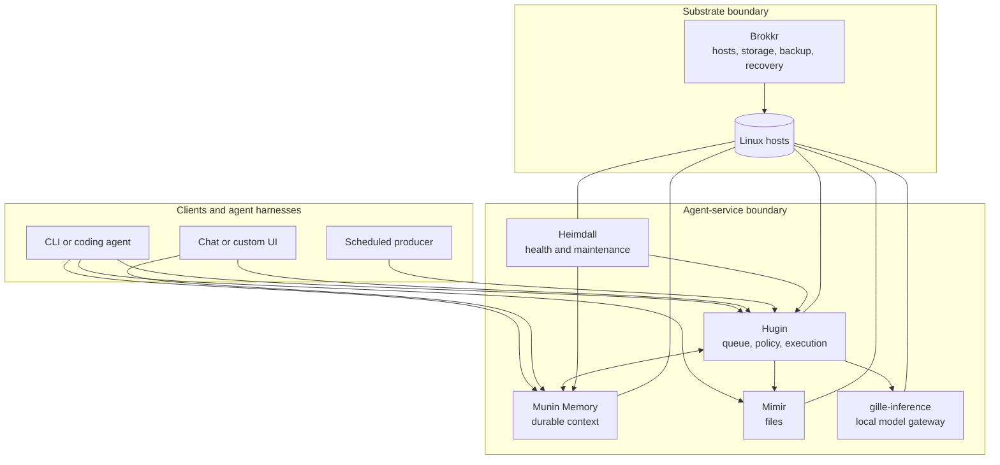
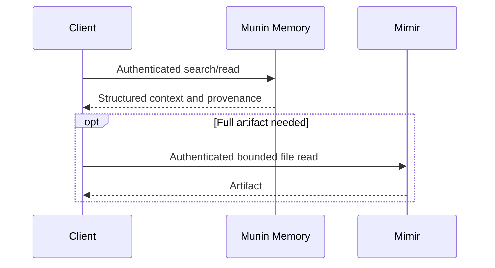
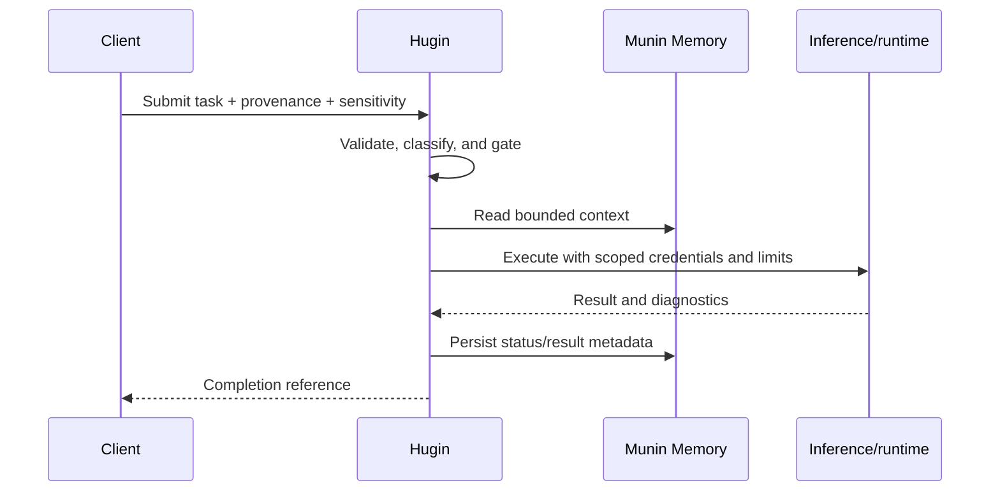

# Grimnir architecture

Grimnir is a modular control plane for self-hosted personal AI. It separates durable knowledge,
user files, asynchronous execution, inference, observability, and host operations so each can be
secured, replaced, and recovered independently.

This document describes the public reference architecture. Names and addresses in
[`services.json`](../services.json) are examples, not a live deployment.

## Goals and non-goals

### Goals

- Keep authoritative memory and files on storage controlled by the operator.
- Let multiple agent clients share context through documented interfaces.
- Gate asynchronous or consequential work before execution.
- Make model runtimes replaceable, including local and remote providers.
- Make every autonomous mutation attributable and reversible where possible.
- Keep operations understandable on ordinary Linux hosts.

### Non-goals

- A hosted multi-tenant SaaS platform.
- A single monolithic assistant UI.
- A guarantee that data never leaves the local network. Configured providers and integrations define
  their own boundaries.
- A turnkey secure deployment. The repository supplies patterns and checks; the operator owns the
  final threat model.

## Component model

### Grimnir: control-plane documentation

This repository owns the component registry, cross-service contracts, example deployment helpers,
and architectural decisions. It deliberately contains no service implementation.

### Munin Memory: durable knowledge

Munin is the shared memory service. Clients use MCP tools to store, retrieve, search, and update
structured entries. It is the durable context boundary, not a general job queue or file store.

Expected controls:

- authentication and principal attribution;
- input size and classification limits;
- secret detection before persistence;
- explicit namespace ownership;
- backup, restore, correction, and deletion procedures.

### Mimir: user-controlled files

Mimir exposes a bounded filesystem through authenticated HTTP APIs. It keeps large or source-format
artifacts out of the memory database while allowing agents to discover and retrieve them.

Expected controls:

- a configured root that cannot be escaped;
- authenticated reads and writes;
- strict proxy trust configuration;
- content-type and size limits;
- recovery independent of the application checkout.

### Hugin: asynchronous execution

Hugin accepts work, evaluates provenance and sensitivity, chooses an execution lane, records state,
and returns results. It is the principal safety gate for work that may execute commands, access
credentials, call networks, or mutate external systems.

Expected controls:

- fail closed when workspace preparation, provenance, or policy checks fail;
- separate untrusted input processing from consequential action sessions;
- least-privilege credentials per executor;
- time, output, network, and concurrency limits;
- a reversal recipe and audit event for autonomous mutations.

### gille-inference: local inference gateway

gille-inference exposes locally served models through an OpenAI-compatible boundary. It isolates
clients from runtime-specific details and provides a stable place for authentication, model policy,
timeouts, and capability discovery.

It is optional: Hugin may target another compatible provider. Local inference improves control over
data and availability, but it does not by itself make the rest of a deployment secure.

#### Learning evidence ownership

The learning architecture has three separate evidence planes. Hugin owns Hugin-origin task identity,
execution, repository/publication outcomes, immutable product review, corrections, prompt/harness
experiments, and macro-routing. `gille-inference` owns direct gateway-origin identity, gateway
rendering and exposure, exact served-model/configuration evidence, capability verdicts, the model
roster, and micro-routing. The content owner remains distinct from both services' transport
identities.

[LearningTaskContract v1](learning-task-contract.md) owns the versioned seam between those planes:
canonical raw-task identity, field ownership, compatibility, governance, immutable pipeline
accounting, and producer/consumer conformance. The LearningTaskContract target requires both components
to emit natural-keyed immutable accounting so failed or retried attempts remain countable even when
no valid joined learning record exists. Owner authority, negative-attempt binding, boundary
exclusions, and cross-owner erasure membership require a separately trusted validation context;
producer body hashes are not authentication. Governance is derived per source and artifact, using
the strictest joined policy.

A completed task, published change, uncalibrated judge, or model self-report cannot substitute for
another plane's verdict. The complete accounting and trust target is not yet implemented end to end.
`promotion-ready` is reviewed evidence only: the owning repository's human operator applies the
exact reversible configuration change. Model-weight training remains outside v1 under
[ADR-006](adr-006-learning-improvement-scope.md). Current maturity and the ordered delivery plan live
in [observability-and-improvement.md](observability-and-improvement.md).

### Heimdall: observability

Heimdall collects service health, task status, maintenance signals, and operator alerts. It is an
observer and control surface, not the owner of service data.

Monitoring endpoints can expose operationally sensitive information. They require authentication
unless bound to a verified local peer boundary, and mutation endpoints require authorization even
when read-only health data is public.

### Brokkr: substrate

Brokkr owns the machines beneath the services: operating-system configuration, storage, patching,
backups, restore tests, and hardware health. It is a peer repository rather than a network service.

This boundary prevents application repositories from becoming the authority for physical layout,
backup destinations, or private network topology.

## Optional integrations

Some installations may add:

- a **message adapter** such as Ratatoskr for chat or notifications;
- a **briefing producer** such as Skuld for scheduled summaries;
- an **external audit sink** such as Verdandi.

They consume the same public contracts as any other client. They are not required to understand or
run the seven-repository core. A custom adapter can submit directly to Hugin, results can be polled,
and audit events can be retained in a deployment-chosen append-only store.

## Core flows

### Interactive context lookup

### Asynchronous work

### Autonomous mutation

Every mutation should produce two linked records:

1. an audit event describing actor, target, reason, and outcome;
2. a reversal recipe (`git_revert`, snapshot restore, compensating action, or an explicit
   irreversible marker plus mitigation).

The exact audit sink is deployment-specific. See
[`failure-recovery.md`](failure-recovery.md) for the contract.

## Trust boundaries

| Boundary | Typical risk | Required control |
|---|---|---|
| Client → service | stolen key, confused deputy, oversized input | per-service auth, principal identity, schema and size validation |
| Untrusted content → executor | prompt injection, secret exfiltration, unsafe commands | content classification, clean-session handoff, scoped tools and egress |
| Service → inference | prompt disclosure, provider retention, model substitution | explicit provider policy, TLS/auth, model allowlist, redaction where appropriate |
| Service → storage | path traversal, unintended persistence, data loss | bounded roots, least privilege, backup and restore tests |
| Monitoring → operator | topology and personal-data disclosure | authenticated dashboards, minimal payloads, retention limits |
| Deployment tooling → hosts | wrong-target or example deployment | validated private registry, explicit targets, fail-closed checks |

Network membership is not authorization. A service reachable only on a LAN or mesh VPN still needs
an identity and authorization model appropriate to its impact.

## Configuration and authority

The committed [`services.json`](../services.json) documents the registry schema with fictional data
and has `"public_example": true`. `scripts/deploy.sh` refuses any registry with that marker.

A real installation copies it to ignored `services.local.json` or supplies an explicit
`REGISTRY_PATH`. That private registry owns:

- enabled components;
- hostnames and ports;
- deployment and persistent-data paths, except Grimnir's fixed control-plane path;
- service manager units;
- inference-node capabilities.

Secrets never belong in either file. They are injected through deployment-specific secret storage or
ignored environment files. See [`authority.md`](authority.md) for the full map.

## Deployment pattern

The reference scripts assume ordinary Linux hosts, systemd units, and SSH/rsync or a controlled
git-pull deployment. This keeps the operating model inspectable, but it is not a universal installer.

Before first use:

1. create and review `services.local.json`;
2. create a dedicated SSH deploy operator and keep the `grimnir` runtime account non-login;
3. configure service authentication and least-privilege identities;
4. if installing the Grimnir timers, provision root-owned source checkouts under
   `/srv/grimnir/source` and the Munin credential at
   `/etc/grimnir/credentials/munin-api-key`;
5. decide which endpoints, if any, cross the private network boundary;
6. configure encrypted backups and perform a restore test;
7. run the repository and component test/security suites;
8. deploy one component at a time with an explicit `DEPLOY_USER` and verify health from both the host
   and intended client path.

## Data lifecycle

Memory, files, job state, monitoring data, and backups have different retention needs. A deployment
must document where each is stored, how a user can correct or erase it, and when deleted content
expires from backups. [`data-lifecycle.md`](data-lifecycle.md) supplies the reference checklist.

## Learning-loop milestone

The next system milestone is one governed real task travelling through exact identity, product
review, an independently verified one-axis experiment, reviewed application, and post-change
evidence. Hugin and `gille-inference` must adopt the same immutable v1 fixtures and fail closed on
unsupported or stale contract preflight before that loop can be described as continuous.

## Maturity and extension points

The architecture has stable conceptual seams, but not yet a stable distribution-level API. New
clients should depend on the service protocols and
[`tenant-contract.md`](tenant-contract.md), not on host paths or undocumented database access.

Replaceable extension points include:

- agent harness and user interface;
- remote or local inference provider;
- notification channel;
- audit-event sink;
- deployment and backup implementation.

This is what distinguishes Grimnir from a single assistant application: the reusable unit is the
contract between small operator-owned services.
