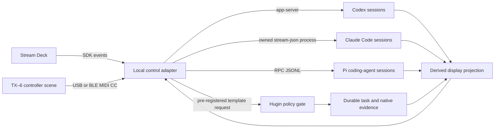

# Physical agent control center — Stream Deck + TX–6

> **Status:** proposed v1 system boundary and implementation brief
>
> **Issue:** [grimnir#179](https://github.com/Magnus-Gille/grimnir/issues/179)
>
> **Contract ID:** `grimnir.physical-agent-control/v1`
>
> **Date:** 2026-07-31

## Decision

Build a **local physical console**, not a new agent orchestrator:

- Stream Deck is the discrete status and action surface.
- Teenage Engineering TX–6 is the continuous-control and optional audio surface.
- Codex, Claude Code, and the Pi coding agent keep their own native session and permission
  boundaries.
- Hugin remains the durable, policy-gated consequential-task plane.
- Grimnir owns only the normalized contract, authority boundary, and cross-component acceptance
  criteria.

The local adapter should be a maintained adaptation of
[`emollick/codex-stream-deck`](https://github.com/emollick/codex-stream-deck), pinned initially to
upstream commit `996b7d25fe42035fd00906e8e770b41f6253b1fa`. Its MIT-licensed local plugin, bounded
loopback bridge, task cards, atomic cache, defensive approval rejection, argument-array process
launches, and exact owned-turn interrupt are the starting point. They are not copied into Grimnir
and they do not become another orchestration plane.

This design interprets “Teenage Engineering ting FX” as the **TX–6 field mixer**. The mapping must
not be installed until macOS hardware enumeration confirms the actual device. No connected Stream
Deck, TX–6, Stream Deck application, or deployed control adapter was observed while this design was
written.

## Why this fits the Grimnir boundary

Grimnir's vision says to reuse the harness layer and build only what touches Memory or
inference-routing. The console therefore reuses Stream Deck's plugin runtime, each agent's native
control protocol, and Hugin's existing task gate. The only new system-level artifact is a narrow,
versioned seam that stops device events from becoming arbitrary agent input.

There is no `services.json` entry. The console is a workstation-local harness accessory, not a
Grimnir service. Hardware UI, MIDI decoding, local IPC, profiles, and agent adapters belong in a
dedicated owning repository or a maintained fork of the upstream plugin.

## Architecture and trust boundaries



The boundaries are deliberately asymmetric:

1. Device input is untrusted. Physical possession is not tenant identity and carries no credential.
2. An owner-reviewed local profile maps a control to one closed action and target. The profile's
   digest and exact binding are checked before accepting an intent.
3. Each harness adapter authenticates independently and retains its native permission, sandbox,
   tool, and approval policy.
4. Read-only status or review turns may use the target adapter only with approvals disabled and no
   writable or network capability.
5. Consequential work is expressed only as an opaque, pre-registered template request and handed to
   Hugin. The physical event is not itself a Hugin task or approval.
6. Authority-reducing operations may interrupt or pause an exact adapter-owned target. Nothing in
   v1 may increase authority.

## Verified implementation inputs

These are evidence about the 2026-07-31 implementation baseline, not claims of deployment:

| Surface | Verified seam | Consequence |
|---|---|---|
| Upstream Stream Deck plugin | One local plugin talks to `codex app-server` over JSONL; runtime, workflow, and freshness are separate; approvals and permission requests are declined | Reuse the process, cache, card, and safety architecture |
| Codex CLI | Installed `codex 0.146.0`; `codex app-server` advertises stdio, Unix-socket, and WebSocket transports | Codex is the first implementation slice |
| Claude Code | Installed `claude 2.1.220`; print mode supports streaming JSON input/output | Control only sessions launched and owned by the adapter; do not imply attachment to arbitrary interactive terminals |
| Pi coding agent | Installed `pi 0.82.1`; RPC mode exposes state, prompt/steer/follow-up, abort, model, thinking level, stats, and session operations over line-delimited JSON | Pi has the strongest analog-control seam, but v1 still starts with display and local preferences |
| Hugin | Broker exposes authenticated submit/await/list/models, principal isolation, and idempotency; current Codex/Claude/Pi workers are one-shot rather than resumable interactive sessions | Hugin owns durable gated requests, never the live-session console |
| TX–6 | Controller mode sends MIDI CC on channel 1 over USB or BLE; the official mapping covers faders 1–6, knobs 7–24, track buttons 25–30, encoder 31/32, FX I/II 33/34, shift 35, aux 36, and cue 37 | Decode a dedicated controller scene through an exact allowlist |

Primary references:

- [Upstream README](https://github.com/emollick/codex-stream-deck/blob/main/README.md),
  [architecture](https://github.com/emollick/codex-stream-deck/blob/main/docs/ARCHITECTURE.md), and
  [security model](https://github.com/emollick/codex-stream-deck/blob/main/SECURITY.md)
- [Stream Deck plugin environment](https://docs.elgato.com/streamdeck/sdk/introduction/plugin-environment/),
  [dial events](https://docs.elgato.com/streamdeck/sdk/guides/dials/), and
  [WebSocket API](https://docs.elgato.com/streamdeck/sdk/references/websocket/plugin/)
- [TX–6 guide](https://teenage.engineering/guides/tx-6) and
  [firmware downloads](https://teenage.engineering/downloads/tx-6)

## Normalized v1 seam

The normative structural contract is
[`physical-agent-control-v1.schema.json`](physical-agent-control-v1.schema.json). The schema is a
closed union of `physical-control-intent` and `physical-control-state`. The dependency-free
validator adds the trusted-clock, canonical-profile, MIDI, action-policy, replay, ownership,
provenance, and freshness rules that cannot be expressed by the supported JSON Schema subset.

### Owner-reviewed profile

The active mapping conforms to
[`physical-agent-control-profile-v1.schema.json`](physical-agent-control-profile-v1.schema.json).
Every binding fixes the complete source selector—device, transport, control or MIDI channel/CC,
and gesture—the exact target including ownership, and the action name. A task-template binding
also fixes its `template_id`. Binding IDs and complete source selectors are unique.

`profile-jcs-sha256-v1` computes the profile digest as lowercase SHA-256 over the UTF-8
[RFC 8785 JSON Canonicalization Scheme](https://www.rfc-editor.org/rfc/rfc8785) bytes of the whole
profile with only `profile_digest` omitted. Object keys are canonicalized and binding-array order
is preserved. The consumer recomputes this digest before activating the profile. Self-asserted
digest equality is not sufficient. The profile content remains owned by the local
adapter repository, while Grimnir owns this safe envelope and digest procedure.

### Intent

An intent binds:

- identity: `intent_id`, `trace_id`, and `idempotency_key`;
- time: `occurred_at`, receiver-stamped `received_at`, and an `expires_at` no more than five
  seconds later;
- ordering: a boot-scoped `stream_id` and strictly increasing `sequence`;
- configuration: `profile_id`, version, SHA-256 digest, and exact `binding_id`;
- a closed Stream Deck or TX–6 source;
- one opaque `session_ref` for `codex`, `claude-code`, or `pi`;
- one closed action and its mechanically fixed safety tuple.

The adapter accepts only the currently active recomputed profile digest and a binding whose full
source selector, target, and action all match. At execution it supplies a trusted current
`evaluated_at` outside the device envelope and requires
`received_at <= evaluated_at < expires_at`; the fixture clock is explicit so historical records
do not masquerade as currently live input. It drops expired and out-of-order events.

Expired input is rejected before any replay lookup. Within the live window, an exact repeated
`intent_id` is ignored and reuse with conflicting content is rejected. An `idempotency_key`
replay of the same activation returns the prior disposition without another activation;
conflicting reuse is rejected. Control events are never durably spooled: reconnecting a device
cannot replay work.

### Closed action policy

| Actions | Effect and route | Confirmation |
|---|---|---|
| `refresh-local-state`, `open-session`, `focus-session` | presentation, local only | none |
| `set-notification-level`, `set-effort`, `set-verbosity`, `set-display-detail`, `set-delegation-preference` | preference, local only | none |
| `request-status-turn`, `request-read-only-review` | target adapter in read-only mode | hold |
| `request-task-template` with an opaque registered `template_id` | consequential, Hugin-gated | hold |
| `interrupt`, `pause` | authority-reducing, exact adapter-owned target | hold |

Preference actions update inert local state. They never alter a running turn, permission mode,
sandbox, tool scope, network access, autonomy tier, or Hugin policy. A later deliberate task
request may read a preference only after its owning adapter clamps it to the target's supported
policy.

### Derived display state

`physical-control-state` is explicitly a **derived-display** projection. It carries an adapter
producer and opaque source reference, then keeps three dimensions separate:

- runtime: whether the process is loaded, idle, active, requesting attention, or in error;
- workflow: working, needs input, blocked, ready for review, done, paused, failed, or unknown;
- freshness: fresh, aging, or stale, recomputed from trusted evaluation time minus `updated_at`.

The producer's native source reference must resolve to the same adapter, harness, and session.
Idle never means done. `done` requires a structured-report reference and digest that resolve to
that same native source, target session, and workflow outcome; an enum label alone is insufficient.
Missing workflow evidence permits only `unknown`. The projection is display-only: it cannot
authorize work, certify a mutation, replace a native Codex/Claude/Pi record, or overwrite a Hugin
result.

## Stream Deck baseline

The baseline is a portable 5×3 layout matching the linked prior art. Larger decks may repeat the
same stable slots; smaller decks page them.

```text
┌────────┬────────┬────────┬────────┬────────┐
│ SLOT 1 │ SLOT 2 │ SLOT 3 │ SLOT 4 │ SLOT 5 │
├────────┼────────┼────────┼────────┼────────┤
│ SLOT 6 │ SLOT 7 │ SLOT 8 │  PAGE  │ HEALTH │
├────────┼────────┼────────┼────────┼────────┤
│REFRESH │  OPEN  │READ-ONLY│TEMPLATE│INTERRUPT│
└────────┴────────┴────────┴────────┴────────┘
```

- A slot has a stable position, harness badge, short title, runtime glyph, workflow label, and
  freshness marker. Colour is supplementary, never the sole state signal.
- Press selects/focuses; double-press opens the exact native session.
- `PAGE`, `HEALTH`, and `REFRESH` are local observations and create no model turn.
- Holding `READ-ONLY` requests status; double-press then hold may select read-only review.
- Holding `TEMPLATE` requests one pre-registered template through Hugin. It does not carry prompt
  text.
- Holding `INTERRUPT` for the configured threshold affects only the exact adapter-owned active
  turn. A vanished or merely observed target fails closed.
- Approval cards may show “needs input” and open the owning client. Hardware never answers an
  approval.

The first implementation keeps upstream's local-only WebSocket/stdio boundary, bounded message
sizes, atomic cache, defensive approval rejection, strict deep-link allowlist, and `shell:false`
process launches. The shared v1 profile excludes upstream's configurable raw prompt, editor command
or path, and workspace-write New Task modes.

## TX–6 baseline

Use a dedicated TX–6 controller scene with MIDI channel 1 and local control disabled for the
agent layer. Keep a separate scene for normal audio mixing so a physical control never silently
changes both audio and agent state.

The official controller-mode values are absolute `0..127` for CC 1–24, signed relative
`-64..63` for encoder CC 31, and button values `0|127`. V1 rejects every other channel, range,
and gesture combination.

| TX–6 control | MIDI | Proposed local meaning |
|---|---:|---|
| Faders 1–6 | CC 1–6 | Per-slot notification level |
| Upper knobs 1–6 | CC 7–12 | Effort preference for the next deliberate gated request |
| Middle knobs 1–6 | CC 13–18 | Response verbosity preference |
| Lower knobs 1–6 | CC 19–24 | Delegation preference: off / auto / prefer local |
| Track buttons 1–6 | CC 25–30 | Select and focus stable slots 1–6 |
| Encoder turn | CC 31 | Selected card display detail; relative delta only |
| Encoder press | CC 32 | Open the selected native session |
| FX I / FX II | CC 33 / 34 | Previous / next local slot bank below the shared intent seam |
| Shift | CC 35 | Local layer modifier only |
| Aux | CC 36 | Reserved; no v1 action |
| Cue, held | CC 37 | Interrupt the exact selected adapter-owned turn |

Continuous input is coalesced latest-wins with debounce and hysteresis. It may set only inert local
preferences; it cannot submit a task, interrupt a turn, or cross an authority boundary. Cue emits
an interrupt intent only after the adapter has recognized the full hold gesture. There is no
Hugin target and no `disarm` action in v1: ADR-008 autonomy disarm has separate constitutional
semantics and cannot be overloaded by a mixer button.

TX–6 audio capture is outside v1. If Aux later becomes push-to-talk, capture and transcription stay
in a separate local path, the transcript is visibly reviewed, and no transcript is automatically
submitted as a prompt.

## Adapter truth and honest capability

The console presents a common card shape, not false feature parity:

| Adapter | V1 truth source | Initially allowed | Must remain unknown or disabled |
|---|---|---|---|
| Codex | `codex app-server` events plus structured task output | cards, refresh, exact open/focus, read-only status/review, exact owned-turn interrupt | anything app-server does not report |
| Claude Code | events from an adapter-owned streaming-JSON process | card projection, exact open/focus; later held read-only requests | attachment to arbitrary existing TUI sessions |
| Pi coding agent | adapter-owned RPC state and events | card projection and local preferences; later abort/steer only through separately reviewed bindings | any session the RPC adapter does not own |
| Hugin | native Broker task/result records | pre-registered consequential template requests and durable result projection | interactive Codex/Claude/Pi session control |

Hugin's current harness executors are one-shot. The console must not label those executions as
resumable sessions. If Hugin advertises no executable model for a template, submission fails
closed.

## Explicit exclusions

V1 has no field or action for:

- raw prompt or transcript text;
- shell command, argv, executable/editor path, URL, or filesystem path;
- credential, token, principal claim, or tenant identity;
- approval or elicitation response;
- permission mode, sandbox, tool, MCP, network, or bypass override;
- model installation or arbitrary model identifier;
- autonomy arm/disarm, deployment, merge, push, repository visibility, authentication change,
  external message, finance, or accounting action;
- direct Munin control-artifact writes.

Unknown actions, fields, bindings, profiles, targets, evidence, or adapter capabilities fail
closed. Extensions are informational only.

## Failure and audit semantics

| Condition | Required behaviour |
|---|---|
| Device reconnect or delayed event | Drop expired input; never replay a durable queue |
| Duplicate key bounce or MIDI burst | Return the stored disposition without another activation; reject conflicting ID/key reuse; coalesce safe continuous preference updates |
| Sequence reset | Require a new stream ID; reject non-increasing sequence in the old stream |
| Stale state | Preserve the last projection with a stale marker; do not infer workflow progress |
| Missing target | Open/focus reports unavailable; reducing or consequential action does nothing |
| Unknown profile or digest | Reject the intent before resolving the target |
| Hugin unavailable or template/model unsupported | Reject the consequential request; never fall back to direct execution |
| Approval/input request | Display and open the native client; never answer from hardware |
| Adapter crash | Native agent continues under its own policy; local preferences may be lost |

A bounded local disposition log may record intent ID, profile digest, binding ID, target reference,
action, timestamps, and accepted/rejected reason. It contains no prompt content or credentials.
These events are operational evidence only: they are not workflow truth, capability evidence,
mutation receipts, or Munin decisions. A Hugin task and its native receipts remain authoritative
after a gated handoff.

## Delivery sequence

### Phase 0 — contract and simulator

- Land this document, schema, positive/adversarial fixtures, and regression guards.
- Use fixture playback as the first device simulator.
- Do not create, install, deploy, or register a service.

Acceptance: focused tests and full `make test` pass; every unsafe payload and replay case fails
closed.

### Phase 1 — Codex Stream Deck slice

- Create a maintained fork or adapter repository only after the owner chooses its name and
  visibility.
- Pin the reviewed upstream commit.
- Add a provider-neutral card model and profile-digest validation.
- Keep only Codex cards, local refresh/health, exact open/focus, held read-only requests, and held
  exact-owned interrupt.
- Exercise at least 1,000 fixture/simulated activations, reconnect, key bounce, stale target, and
  adapter restart without an unsafe or duplicate action.

### Phase 2 — TX–6 local control

- Confirm the real USB/BLE device identity and firmware before binding.
- Add MIDI decode, channel/range enforcement, debounce, hysteresis, stream sequence, and expiry.
- Start with selection, paging, display detail, notifications, and exact-owned held interrupt.
- Keep effort, verbosity, and delegation as visible but inert local preferences until their later
  use is separately accepted.

### Phase 3 — Pi and Claude adapters

- Add Pi RPC first because it exposes an explicit state and abort surface.
- Add Claude only for adapter-owned streaming-JSON sessions.
- Represent unsupported state as unknown; do not scrape terminal text to fabricate parity.
- Validate each adapter with its own synthetic trace corpus before enabling a physical binding.

### Phase 4 — Hugin template handoff

- Register fixed public-safe template IDs and a dedicated principal in Hugin's owning repository.
- Bind retries to the physical intent's idempotency key.
- Use authenticated submit/await/list/models only; no direct writes to Munin cancellation or
  approval artifacts.
- File an owning Hugin issue before any new authenticated cancellation or approval API is needed.

## Ownership

| Fact or implementation | Authority |
|---|---|
| Shared envelope, closed actions, safety semantics, and fixtures | Grimnir contract/schema |
| Device mapping, debounce, local IPC, active profile, and profile digest | Owning control-adapter repository |
| Session identity, native action execution, and runtime/workflow truth | Codex, Claude Code, or Pi adapter and native harness |
| Consequential task admission, identity, execution, result, and idempotency | Hugin's existing task contracts |
| Mutation outcome and audit evidence | Existing owning mutation boundary, never a hardware event |

The first owner decision still required is the implementation repository and its initial
visibility. A suggested shape is a maintained provider-neutral fork, but this document does not
create one or authorize a visibility choice.

## Verification

Run:

```sh
make test-physical-agent-control
make test-physical-agent-control-doc
make test
```

The fixtures cover a canonically digested active profile, valid Stream Deck and TX–6 intents, all
three harnesses, exact owned-turn interrupt, and derived states. Adversarial cases cover unknown
fields/actions, raw prompt injection, MIDI range/channel/gesture/transport aliasing,
continuous-to-consequential escalation, action-policy mismatch, evaluation-time expiry, impossible
dates, profile tampering and duplicate bindings, target redirection, exact and conflicting
ID/idempotency replays, out-of-order sequences, unresolvable completion reports, replayed
freshness, source/session mismatch, and authority increase.
