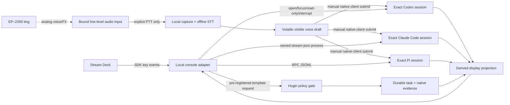

# Physical agent console — Stream Deck + EP–2350 ting

> **Status:** proposed v1 system boundary and implementation brief
>
> **Issue:** [grimnir#179](https://github.com/Magnus-Gille/grimnir/issues/179)
>
> **Contract ID:** `grimnir.physical-agent-control/v1`
>
> **Date:** 2026-07-31

## Decision

Build a **local physical console, not a new agent orchestrator**:

- Stream Deck is the only v1 control-event, status, and confirmation surface.
- Teenage Engineering EP–2350 ting is an optional analog voice/FX source. It is not treated as a
  MIDI, HID, USB-audio, or host-control device.
- Voice capture creates a short-lived local draft. It does not create an agent turn, choose an
  approval answer, or carry authority.
- Codex, Claude Code, and the Pi coding agent retain their native session, sandbox, tool, and
  permission boundaries.
- Hugin remains the durable, policy-gated consequential-task plane.
- Grimnir owns only the normalized contracts, authority boundary, and cross-component acceptance
  criteria.

The local adapter should be a maintained adaptation of
[`emollick/codex-stream-deck`](https://github.com/emollick/codex-stream-deck), pinned initially to
upstream commit `996b7d25fe42035fd00906e8e770b41f6253b1fa`. Its MIT-licensed local plugin, bounded
loopback bridge, task cards, atomic cache, defensive approval rejection, argument-array process
launches, and exact owned-turn interrupt remain the starting point. They are not copied into
Grimnir and they do not become another orchestration plane.

The earlier draft incorrectly interpreted “ting FX” as a TX–6 mixer. The intended device is the
**EP–2350 ting performance microphone**. This document replaces every TX–6/MIDI assumption before
v1 lands. No connected Stream Deck, EP–2350, audio interface, Stream Deck application, or deployed
adapter was observed while this correction was written.

## Why this fits the Grimnir boundary

Grimnir's vision says to reuse the harness layer and build only what touches Memory or
inference-routing. The console therefore reuses Stream Deck's plugin runtime, a local audio/STT
stack, each agent's native control protocol, and Hugin's task gate. The new system-level artifacts
are narrow, versioned seams that keep key events and microphone audio from becoming arbitrary
authority.

There is no `services.json` entry. The console is a workstation-local harness accessory, not a
Grimnir service. Hardware mapping, CoreAudio input binding, local IPC, volatile drafts, profiles,
and agent adapters belong in a dedicated owning repository or maintained fork of the upstream
plugin.

## Verified EP–2350 boundary

The official v1.0.8 guide documents:

- a standalone lo-fi handheld microphone with four FX presets;
- four replaceable samples in approximately 1 MB of storage;
- a handle and shake modulation that alter local audio effects;
- stereo line output over the fixed 3.5 mm cable, up to 8 dBu / 2 Vrms;
- USB-C power, firmware boot-volume access, and a `tingdisk` mass-storage volume for WAV files and
  `config.json`.

The guide does **not** document USB audio, MIDI, BLE, HID, a host API, or computer-readable events
for its buttons, handle, or shake sensor. V1 therefore makes no such claim. An external line-level
audio interface is required unless the workstation already has a suitable line input. USB-C is a
maintenance/power path, never live control IPC.

Primary references:

- [EP–2350 store page](https://teenage.engineering/store/ep-2350)
- [EP–2350 v1.0.8 guide](https://teenage.engineering/guides/ep-2350)
- [Upstream Stream Deck README](https://github.com/emollick/codex-stream-deck/blob/main/README.md),
  [architecture](https://github.com/emollick/codex-stream-deck/blob/main/docs/ARCHITECTURE.md), and
  [security model](https://github.com/emollick/codex-stream-deck/blob/main/SECURITY.md)
- [Stream Deck key events](https://docs.elgato.com/streamdeck/sdk/guides/keys/),
  [plugin environment](https://docs.elgato.com/streamdeck/sdk/introduction/plugin-environment/),
  and [WebSocket API](https://docs.elgato.com/streamdeck/sdk/references/websocket/plugin/)

## Architecture and trust boundaries



The boundaries are deliberately asymmetric:

1. Stream Deck events, microphone audio, transcripts, samples, effects, and physical possession are
   untrusted input. None proves tenant identity or carries a credential.
2. An owner-reviewed local profile maps each Stream Deck gesture to one closed action and exact
   target. Its recomputed digest and full binding are checked before an intent is accepted.
3. EP–2350 analog input is operator-configured, not authenticated hardware identity. The adapter
   binds an opaque local source reference that resolves to one exact CoreAudio interface UID,
   generation, and channel set. A disconnect or mismatch cancels capture; it never falls back to
   another microphone.
4. A dedicated Stream Deck key-down begins push-to-talk and its key-up ends capture. Capture also
   stops after 30 seconds, focus loss, adapter failure, or source loss. Every non-key-up stop emits
   bounded cancellation evidence proving audio deletion and no draft; it clears the active capture
   so a later PTT can start cleanly. A late release is rejected. Key-up creates a draft; it never
   submits one.
5. STT is local/offline with networking disabled. Raw audio is memory-only and deleted after
   transcription, cancellation, timeout, or failure. The transcript remains in volatile local
   memory only until review, discard, or a short expiry.
6. The full transcript and exact target snapshot are shown together. Native-client submission is a
   separate deliberate user action outside the physical-control contract. Any future held-key
   submission needs its own threat review and digest-bound acceptance fixtures.
7. Each harness adapter authenticates independently and preserves its native permission, sandbox,
   tool, network, and approval policy.
8. Consequential preset work is still only an opaque, pre-registered template request handed to
   Hugin. Voice cannot choose a template or provide a Hugin prompt.
9. Authority-reducing operations may interrupt or pause only an exact adapter-owned target.
   Nothing in v1 may increase authority.

## Verified implementation inputs

These are evidence about the 2026-07-31 implementation baseline, not deployment claims:

| Surface | Verified seam | Consequence |
|---|---|---|
| Upstream Stream Deck plugin | One local plugin talks to `codex app-server` over JSONL; runtime, workflow, and freshness are separate; approvals and permission requests are declined | Reuse the process, cache, card, and safety architecture |
| Codex CLI | Installed `codex 0.146.0`; `codex app-server` advertises stdio, Unix-socket, and WebSocket transports | Codex is the first implementation slice |
| Claude Code | Installed `claude 2.1.220`; print mode supports streaming JSON input/output | Control only sessions launched and owned by the adapter; do not imply attachment to arbitrary terminals |
| Pi coding agent | Installed `pi 0.82.1`; RPC mode exposes state, prompt/steer/follow-up, abort, model, thinking level, stats, and session operations over JSONL | Display and exact-owned control are plausible, but Hugin #339 must be resolved before its one-shot worker is treated as worktree-bound |
| Hugin | Broker exposes authenticated submit/await/list/models, principal isolation, and idempotency; current Codex/Claude/Pi workers are one-shot rather than resumable sessions | Hugin owns durable gated templates, never capture or live-session voice routing |
| EP–2350 | Analog stereo line output plus locally mutable FX/samples; USB-C power and mass storage only in the documented host workflow | Treat as untrusted audio through an exact external input; never manufacture control events |

## Normalized v1 seams

The normative control contract is
[`physical-agent-control-v1.schema.json`](physical-agent-control-v1.schema.json). It is a closed
union of `physical-control-intent` and `physical-control-state`. The separate
[`physical-agent-voice-draft-v1.schema.json`](physical-agent-voice-draft-v1.schema.json) describes
public-safe metadata for a volatile local transcript draft; it carries neither audio nor text and
cannot execute an action. The separate
[`physical-agent-voice-capture-cancellation-v1.schema.json`](physical-agent-voice-capture-cancellation-v1.schema.json)
records a watchdog, focus-loss, source-loss, or adapter-failure stop with mandatory
`audio_deleted: true` and `draft_created: false` outcomes.

The dependency-free validator adds trusted-clock, canonical-profile, action-policy, replay,
ownership, PTT, source-resolution, volatile-retention, transcript-binding, provenance, and
freshness rules that cannot be expressed by the supported JSON Schema subset.

### Owner-reviewed profile

The fixture profile conforms to
[`physical-agent-control-profile-v1.schema.json`](physical-agent-control-profile-v1.schema.json).
Every control binding fixes the complete Stream Deck selector—device, transport, control, and
gesture—the exact target including ownership, and the action name. A task-template binding also
fixes its `template_id`. Binding IDs and full source selectors are unique.

When voice capture is enabled, the profile's voice-capture policy fixes one opaque audio source
reference plus its exact CoreAudio UID, interface generation, and channel set; an
operator-configured EP–2350 claim; analog transport; and exact offline STT engine/model versions.
It also fixes the local-only transcription boundary, zero durable-audio retention, 30-second
capture ceiling, 15-minute transcript ceiling, disabled sample semantics, and non-semantic effects.
Both the audio tuple and the pinned STT runtime must resolve in local registries and be available;
neither may silently substitute. The device claim is not authentication. A Stream Deck-only
profile omits this policy and every capture/draft binding.

`profile-jcs-sha256-v1` computes the profile digest as lowercase SHA-256 over the UTF-8
[RFC 8785 JSON Canonicalization Scheme](https://www.rfc-editor.org/rfc/rfc8785) bytes of the whole
profile with only `profile_digest` omitted. Object keys are canonicalized and binding-array order
is preserved. The consumer recomputes this digest before activation. Self-asserted digest equality
is not sufficient.

### Control intent

An intent binds:

- identity: `intent_id`, `trace_id`, and `idempotency_key`;
- time: whole-second UTC `Z` `occurred_at`, receiver-stamped `received_at`, and an `expires_at` no more than five seconds later;
- ordering: a boot-scoped `stream_id` and strictly increasing `sequence`, represented as a safe integer;
- configuration: profile ID, version, SHA-256 digest, and exact binding ID;
- one closed Stream Deck source—EP–2350 is structurally impossible here;
- one opaque session reference for `codex`, `claude-code`, or `pi`;
- one closed action and its mechanically fixed safety tuple.

Each begin/end capture action also carries one unique `capture_ref`, the exact
`adapter_instance_ref` generation, and a canonical full-target snapshot reference and digest. The
snapshot binds the native session, project, worktree, runtime-at-capture, adapter generation, and
coarse harness/slot target before audio capture starts. `target-snapshot-jcs-sha256-v1` is lowercase
SHA-256 over the UTF-8 RFC 8785 canonical snapshot with only `snapshot_digest` omitted. A slot
remap must mint a new immutable snapshot reference and digest.

The adapter reconstructs PTT state from accepted intents plus validated cancellation records: a
begin cannot overlap any active capture on the profile's single capture source or reuse a completed/cancelled capture reference, and a release must close the same capture, control, target snapshot, stream, and adapter generation.
The 30-second watchdog emits cancellation evidence, deletes buffered audio, creates no draft, and
clears the active state. At the exact ceiling, watchdog cancellation has deterministic precedence
over a simultaneous release. Releases after the ceiling, orphaned releases, cross-restart releases, and
orphaned cancellations fail closed. Both profile and intent validation require a dedicated
`key-*` control; Stream Deck dials cannot become PTT selectors.

At execution the adapter supplies a trusted current `evaluated_at` outside the device envelope and
requires `received_at <= evaluated_at < expires_at`. Expired input is rejected before replay
lookup. Within the live window, an exact repeated intent ID is ignored, conflicting reuse is
rejected, and an idempotency-key replay returns the prior disposition without another activation.
Events are never durably spooled, so reconnecting a device cannot replay work.

### Voice draft

A `physical-agent-voice-draft` is metadata for one completed PTT capture. It binds:

- the exact key-down/key-up intent IDs, capture reference, controls, stream, adapter generation,
  canonical full-target snapshot reference/digest, and profile digest that gated capture;
- an opaque capture-source reference that resolves to the configured interface UID, generation,
  and channel set;
- an exact adapter instance, native session, harness, project, and worktree snapshot;
- capture timestamps and a maximum 30-second duration;
- a pinned local STT engine/model version with network access disabled;
- an opaque volatile content reference, UTF-8 byte count, and a keyed HMAC-SHA-256 binding;
- review state, disposition, and expiry no more than 15 minutes after capture.

`voice-content-hmac-sha256-v1` is lowercase HMAC-SHA-256 with a 32-byte adapter-local secret over
the UTF-8 bytes of the RFC 8785 canonical object
`{"draft_id":…,"transcript_version":…,"utf8_text":…}`; the record stores only the
`hmac-sha256:`-prefixed result. The keyed binding prevents a short transcript from being guessed
from a public hash. The key and transcript never enter the metadata record, logs, or metrics.
Editing content increments `transcript_version` and invalidates the previous review binding. A
draft contains no action and no submitted state. It may be opened, reviewed, edited, discarded,
or manually submitted in the native client; its metadata cannot authorize execution.

A `physical-agent-voice-capture-cancellation` is the only successful terminal record for a capture
that did not end on key-up. It resolves the exact begin intent, capture reference, control, stream,
adapter generation, target snapshot, and profile. Watchdog evidence occurs exactly at the profile
ceiling; focus/source/adapter failure occurs after begin and no later than that ceiling. The closed
outcome proves buffered audio deletion and forbids draft creation. Cancellation IDs and capture
references are unique, and a cancelled capture ID can never appear in a voice draft.

### Closed action policy

| Actions | Effect and route | Confirmation |
|---|---|---|
| `refresh-local-state`, `open-session`, `focus-session`, `open-voice-draft` | presentation, local only | none |
| `begin-voice-capture`, `end-voice-capture` | capture, local capture path | Stream Deck key-down / key-up |
| `discard-voice-draft` | data reducing, local reducing | hold |
| `request-status-turn`, `request-read-only-review` | exact target adapter in read-only mode | hold |
| `request-task-template` with fixed opaque `template_id` | consequential, Hugin-gated | hold |
| `interrupt`, `pause` | authority reducing, exact adapter-owned target | hold |

Capture and draft actions require an exact adapter-owned target. `end-voice-capture` only closes the
capture opened by the matching PTT key-down, target snapshot, stream, and adapter generation.
Neither key-up, silence, a spoken word, nor an EP–2350 sample can submit content.

### Derived display state

`physical-control-state` is a **derived-display** projection. Runtime, workflow, and freshness stay
separate. The native source must resolve to the same adapter, harness, and session. An
`adapter-event` must resolve to that same source, target, and workflow. Idle never means done.
`done` requires a structured-report reference and digest for that same source, target, and workflow
outcome. Missing evidence permits only `unknown`. The projection is display-only: it
cannot authorize work, certify mutation, replace native records, or overwrite a Hugin result.

## Stream Deck baseline

The baseline remains a 5×3 layout. Smaller decks page the same stable bindings.

```text
┌────────┬────────┬────────┬────────┬────────┐
│ CODEX  │ CLAUDE │   PI   │ HEALTH │  PAGE  │
├────────┼────────┼────────┼────────┼────────┤
│  PTT   │ DRAFT  │DISCARD │ STATUS │ REVIEW │
├────────┼────────┼────────┼────────┼────────┤
│REFRESH │  OPEN  │TEMPLATE│ PAUSE  │INTERRUPT│
└────────┴────────┴────────┴────────┴────────┘
```

- Harness keys select a stable, exact session page. Press focuses; double-press opens.
- `PTT` glows red and shows elapsed time while held. Key-down begins capture; key-up ends it and
  creates a draft. A lost key-up is covered by the 30-second watchdog.
- `DRAFT` opens the full transcript beside its exact target snapshot. It never sends.
- Holding `DISCARD` deletes the volatile draft after an exact content-binding check.
- `HEALTH`, `PAGE`, and `REFRESH` are local observations and create no model turn.
- Holding `STATUS` or `REVIEW` invokes only the closed read-only adapter path.
- Holding `TEMPLATE` requests one pre-registered Hugin template without prompt text.
- Holding `INTERRUPT` affects only the exact adapter-owned active turn.
- Approval cards may show “needs input” and open the owning client. Hardware never answers an
  approval.

The first implementation keeps upstream's local-only boundary, bounded message sizes, atomic
cache, defensive approval rejection, strict deep-link allowlist, and `shell:false` process
launches. Configurable raw prompts, arbitrary editor commands/paths, and workspace-write “New Task”
modes remain excluded.

## EP–2350 voice baseline

The usable v1 path is intentionally plain:

1. Connect ting's 3.5 mm line output to a suitable line-level audio input.
2. Bind one exact local CoreAudio UID/generation/channel set; disable fallback and monitoring.
3. Select no effect on ting for dictation. Configure conservative input gain and clipping checks.
4. Hold the dedicated Stream Deck PTT key while holding ting's push-to-sing handle.
5. Transcribe locally with a pinned offline engine; display confidence without model-based semantic
   cleanup.
6. Show the complete volatile transcript and target. Submission happens manually in the native
   client.

The four replaceable samples and editable FX graph are delightful experimental material, but not
v1 control semantics. Safe experiments include self-authored calibration tones, offline STT
regression inputs, or creative monitoring on a path isolated from STT. Because samples are mutable
and analog audio is replayable, no sample, effect, handle movement, shake, “secret button,” spoken
“yes,” or acoustic fingerprint may select a target, send a draft, answer an approval, interrupt an
agent, or choose a Hugin template.

Never poll `tingdisk` as IPC and never let an agent silently write `config.json`, samples, or
firmware. Maintenance uses explicit unmounted capture state and owner action.

## Adapter truth and honest capability

| Adapter | V1 truth source | Initially allowed | Must remain unknown or disabled |
|---|---|---|---|
| Codex | `codex app-server` events plus structured task output | cards, refresh, exact open/focus, read-only status/review, exact-owned interrupt, native manual voice-draft entry | anything app-server does not report |
| Claude Code | events from an adapter-owned streaming-JSON process | card projection, exact open/focus; later held read-only requests and native manual draft entry | attachment to arbitrary existing TUI sessions |
| Pi coding agent | adapter-owned RPC state and events | card projection; later exact-owned abort after Hugin #339 is resolved | sessions or worktrees the adapter cannot prove it owns |
| Hugin | native Broker task/result records | pre-registered consequential templates and durable result projection | audio, STT, arbitrary voice prompts, or interactive session control |
| Voice capture | exact Stream Deck PTT gate, local source registry, pinned STT, volatile content binding | local draft creation/display/discard | identity, approval, submission, durable retention, or authority |

## Explicit exclusions

V1 has no field or action for:

- raw audio, waveform/base64 data, transcript text, or prompt text in a control intent, voice-draft
  metadata record, log, metric, crash spool, Munin entry, or Hugin request;
- EP–2350 button, handle, shake, sample, effect, USB, MIDI, BLE, HID, mass-storage, or acoustic
  event as a control source;
- automatic submission on key-up, silence, VAD, wake word, sample recognition, or spoken command;
- shell command, argv, executable/editor path, URL, filesystem path, `config.json`, WAV, or firmware
  payload;
- credential, token, principal claim, tenant identity, approval, or elicitation response;
- permission mode, sandbox, tool, MCP, network, model, or bypass override;
- autonomy arm/disarm, deployment, merge, push, repository visibility, authentication change,
  external message, finance, or accounting action;
- direct Munin control-artifact writes or cloud STT.

Unknown actions, fields, profiles, targets, drafts, evidence, sources, adapters, interfaces, or
capabilities fail closed. Extensions are informational only.

## Failure and audit semantics

| Condition | Required behaviour |
|---|---|
| Device reconnect or delayed key event | Drop expired input; never replay a durable queue |
| Duplicate key bounce | Return the stored disposition without another activation; reject conflicting ID/key reuse |
| Sequence reset | Require a new stream ID; reject non-increasing sequence in the old stream |
| Lost PTT key-up, focus, adapter process, source, or adapter generation change | Emit bounded cancellation evidence, delete audio, clear active capture, reject late/orphan/cross-restart release, permit a later clean recapture, and never create or send a partial draft |
| Native session/project/worktree remapped within a visible slot | Require a new immutable snapshot ref/digest before capture; reject stale PTT or draft metadata |
| Audio UID, generation, or channel mismatch | Cancel capture; never fall back to the Mac microphone or another input |
| Clipping, empty audio, or STT failure | Show failure/retry; retain neither audio nor invented transcript |
| Low-confidence transcript | Require visible review or retry; never silently rewrite with another model |
| Draft edited after review | Increment version and invalidate the old keyed review binding |
| Expired/discarded draft | Delete the ephemeral record and volatile content; reject later open/discard requests |
| Stale agent state | Preserve the projection with a stale marker; infer no progress |
| Missing target | Open/focus reports unavailable; reducing or consequential action does nothing |
| Unknown profile/digest | Reject before resolving target or starting capture |
| Hugin unavailable/template unsupported | Reject; never fall back to direct execution |
| Approval/input request | Display and open the native client; never answer from hardware or voice |

A bounded disposition log may record IDs, profile digest, binding ID, opaque target/source refs,
action, timestamps, STT version, duration, byte count, confidence, and accepted/rejected reason. It
contains no audio, transcript, unkeyed content digest, prompt, path, or credential. These events are
operational evidence only, never workflow truth, mutation receipts, capability evidence, or Munin
decisions.

## Delivery sequence

### Phase 0 — corrected contract and simulators

- Land this document, four schemas, positive/adversarial fixtures, and regression guards.
- Use control-event and metadata fixture playback before touching hardware.
- Do not create, install, deploy, or register a service.

### Phase 1 — Codex Stream Deck slice

- Create a maintained fork or adapter repository only after the owner chooses its name and
  visibility.
- Pin the reviewed upstream commit.
- Implement Codex cards, refresh/health, exact open/focus, held read-only requests, and exact-owned
  interrupt.
- Exercise at least 1,000 simulated activations, reconnects, bounces, stale targets, and restarts
  with no unsafe or duplicate action.

### Phase 2 — EP–2350 capture experiment

- Enumerate the actual hardware, firmware, line-level audio interface, UID, channel set, clipping,
  latency, noise floor, and no-effect transcription quality.
- Confirm that USB-C exposes no supported audio/control path before relying on analog capture.
- Implement exact-source PTT, 30-second watchdog, offline STT, unmistakable indicators, volatile
  draft display, edit invalidation, expiry, and discard.
- Test disconnect, source substitution, lost key-up, crash, feedback, clipping, silence, ambient
  speech, replayed agent audio, low confidence, and all four effects.
- Do not enable physical-key submission or acoustic command tokens in this phase.

### Phase 3 — Pi and Claude adapters

- Add Pi RPC only after the worktree/cwd ownership defect in Hugin #339 is resolved where relevant.
- Add Claude only for adapter-owned streaming-JSON sessions.
- Represent unsupported state as unknown; do not scrape terminal text to fabricate parity.

### Phase 4 — separately reviewed experiments

- Evaluate whether held Stream Deck submission of an exact reviewed draft can be safe. Require the
  current keyed content binding, unchanged target snapshot, idle exact-owned session, and native
  policy preservation.
- Evaluate self-authored sample tones only as non-authoritative draft-editing or calibration hints.
  Recorded or ambient audio must be unable to cause action.
- Register fixed public-safe Hugin template IDs through Hugin's owning repository; voice cannot
  populate them.

## Ownership

| Fact or implementation | Authority |
|---|---|
| Control/voice draft/cancellation metadata envelopes, closed actions, safety semantics, and fixtures | Grimnir contracts/schemas |
| Stream Deck mapping, local profile, CoreAudio binding, volatile content, STT, IPC, and digest/HMAC keys | Owning local console-adapter repository |
| EP–2350 firmware/config/samples | Owner through documented maintenance workflow; never an agent-control plane |
| Session identity, native action execution, and runtime/workflow truth | Codex, Claude Code, or Pi adapter and native harness |
| Consequential template admission, execution, result, and idempotency | Hugin's existing task contracts |
| Mutation outcome and audit evidence | Existing owning mutation boundary, never hardware, audio, or draft metadata |

The first owner decision still required is the implementation repository and its initial
visibility. This document creates neither and authorizes no visibility change.

## Verification

Run:

```sh
make test-physical-agent-control
make test-physical-agent-control-doc
make test
```

Fixtures cover a canonically digested Stream Deck-only profile, valid control intents, an exact
stateful PTT-gated EP–2350 metadata draft, a watchdog cancellation followed by successful clean
recapture, all three harness states, exact-owned interruption, and replay dispositions. Hermetic
synthetic volatile-content vectors compute the byte count and HMAC from test-only text and keys;
normative metadata contains neither. Adversarial cases reject undocumented ting transports/events,
inline audio/text, cloud or retained audio, orphaned, overlapping, reused, late, or cross-restart
PTT, invalid cancellation timing/outcomes, draft creation from a cancelled capture, dial-based
capture, unpinned STT, CoreAudio UID/generation/channel substitution, slot/worktree remapping
without a new canonical target digest, excessive duration, expired drafts, source/target
substitution, weak/plain or incorrectly computed content hashes, duplicate capture IDs,
edit/review mismatch, prompt/approval/permission fields, profile tampering, replay conflicts,
fabricated completion, stale freshness, and every authority increase.
